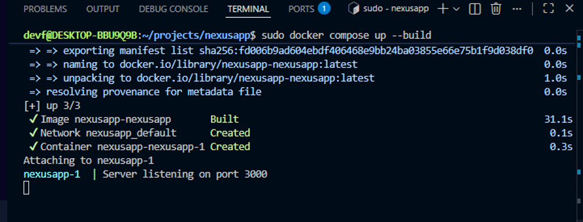
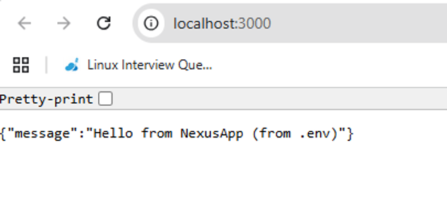
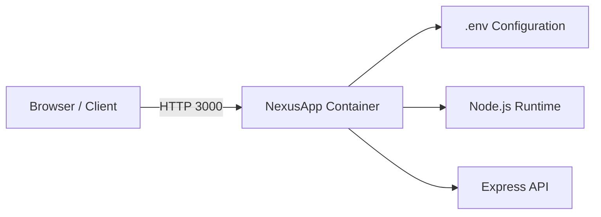

# NexusApp

## Project overview

NexusApp is a lightweight Node.js application built with Express to demonstrate containerized deployment in a WSL environment. The application exposes a simple REST endpoint at `/` that returns a JSON greeting message using environment variables.

The project was designed to showcase:

- containerization with Docker
- local orchestration with Docker Compose
- environment-based configuration
- simple CI/CD image validation using GitHub Actions
- a clean deployment workflow suitable for development and cloud environments

## Tools and platforms used

- Node.js 18
- Express.js
- Docker
- Docker Compose
- Git and GitHub
- GitHub Actions
- WSL2 / Ubuntu Linux
- Environment variables via `.env`

## Deployment process

1. Install project dependencies locally using `npm install`.
2. Configure environment variables in a `.env` file.
3. Run the app locally with `npm start` or through Docker.
4. Build the Docker image using the `Dockerfile`.



5. Start the container using Docker Compose or `docker run`.
6. Verify the service is reachable on `http://localhost:3000`.



7. Optionally, build the image in CI and publish it as an artifact for later deployment.

### Local run

    ```bash
    npm install
    PORT=3000 GREETING="Hello from NexusApp" npm start
    ```

### Docker run

    ```bash
    docker compose up --build
    ```

### Manual Docker deployment

    ```bash
    docker build -t nexusapp:local .
    docker run -p 3000:3000 --env-file .env --name nexusapp nexusapp:local
    ```

## Infrastructure architecture

The project follows a simple container-based architecture:



In this design:

- the application runs inside a Docker container
- environment variables are injected at runtime from `.env`
- the host machine maps port `3000` to the container port `3000`
- Docker Compose simplifies startup and management for local development

## CI/CD pipeline

The repository includes a basic GitHub Actions workflow defined in `.github/workflows/docker-build.yml`.

### Pipeline behavior

- Triggered on pushes to the `main` branch
- Triggered manually with `workflow_dispatch`
- Checks out the repository
- Sets up QEMU and Docker Buildx
- Builds the Docker image
- Saves the image as a `.tar` artifact
- Uploads the artifact for later use or distribution
- Optionally pushes to a Docker registry if the required secrets are configured

### Example workflow summary

```yaml
name: Build Docker image

on:
  push:
    branches: [ main ]
  workflow_dispatch: {}
```

This pipeline helps validate that the project still builds successfully after code changes, which is essential for reliable deployment automation.

## Challenges encountered

- Initial environment mismatch between local development and container execution
- Ensuring the correct Node.js version and runtime settings were used in Docker
- Managing configuration via environment variables to keep the app portable
- Removing obsolete Compose configuration such as the deprecated `version:` field
- Aligning the Docker image with a minimal production setup without unnecessary overhead

## Recommendations or lessons learned

- Use Docker Compose for local orchestration instead of manual container commands when possible
- Keep environment variables in `.env` for local configuration and document defaults clearly
- Use lightweight base images such as `node:18-alpine` to reduce image size
- Validate the build in CI before deployment to catch setup issues early
- Document the deployment flow so onboarding is easier for future contributors
- Prefer small, testable services and simple architecture when building a first containerized application

## Project structure

- `src/index.js` — Express application entry point
- `package.json` — Node.js dependencies and scripts
- `Dockerfile` — Docker image definition
- `docker-compose.yml` — local container orchestration
- `.env` — runtime environment values
- `.github/workflows/docker-build.yml` — CI workflow
- `README.md` — project documentation
- `REFLECTION.md` — notes on the containerization approach

## Environment variables

Example `.env` file:

```env
PORT=3000
GREETING=Hello from NexusApp
```

## Useful commands

```bash
npm install
npm start
docker compose up --build
docker compose down
docker logs nexusapp
```
